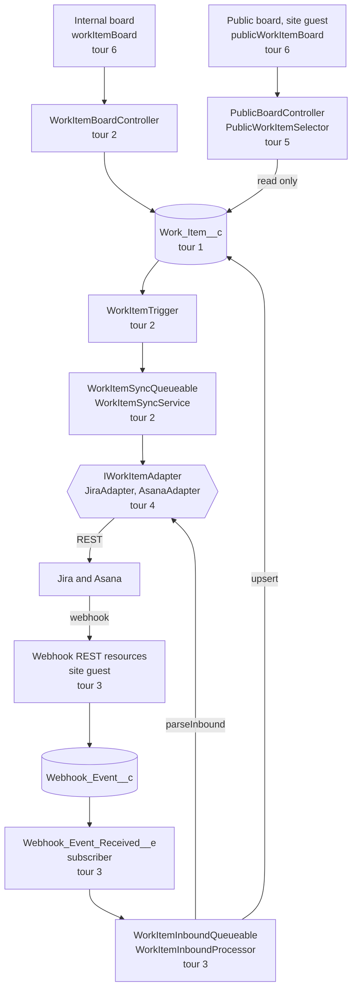

# Code tour

A guided route through version 1 of Portfolio HQ: what each part does, the platform concepts it
rests on, and why it is built the way it is. Seven tours, each a short walk along one path through
the system, and every stop sits on a real line of code.

## Taking it

- **In VS Code**, install the [CodeTour](https://marketplace.visualstudio.com/items?itemName=vsls-contrib.codetour)
  extension (the workspace recommends it), open the CodeTour view and start _1 · The shape of the
  system_. Each stop opens its file at the line it describes, and each tour offers the next when
  it ends.
- **On GitHub, or in any Markdown viewer**, start at [1 · The shape of the system](01-shape.md).
  Every stop links to its line.

The tours build on each other in order, but each one stands alone once the first has been read.

## How a stop reads

Every stop is titled with the question the code at that line answers, and every stop answers it in
the same order:

1. **The answer**, in a few sentences, with the reasoning behind the choice.
2. **Concept**, where a platform idea first matters: what a reader new to Salesforce needs to
   follow the stop.
3. **Failure mode**: what goes wrong if the code is written the obvious other way, and how that
   would show. Most of the failures this project guards against are silent, so this part says how
   each one would have been noticed, or why it would not have been.
4. **Pattern**: the general rule the stop is an instance of, named. The same thirty patterns recur
   across the tours, and the [index below](#patterns) lists each one with every stop where it
   appears.

## The route

The outbound path runs down the left; the inbound loop comes back up through the same adapter to the
same record. Tour 7 is about how all of it is tested and operated.

## Tours

<!-- tours:start -->

1. **[The shape of the system](01-shape.md)** (7 stops). The few types everything else is built on: one record per piece of work, keyed on the source system's own id, and an interface that keeps each source's vocabulary out of the rest of the code.
2. **[Outbound: a save becomes a push](02-outbound.md)** (13 stops). One edit, followed from the internal board to Jira or Asana. The save commits at once; the push runs later in a transaction of its own, sends exactly the fields that changed, and writes back how far it got.
3. **[Inbound: a webhook becomes a record](03-inbound.md)** (16 stops). A delivery from Jira or Asana, followed from an anonymous POST to an upserted work item. The endpoint runs as the site's guest user and does almost nothing; the work happens later, as another user, in a transaction that is allowed to call out.
4. **[Two adapters behind one interface](04-adapters.md)** (10 stops). Jira and Asana differ in almost every way the integration cares about. Jira sends everything in the payload and moves status through workflow transitions. Asana sends an id and an action, models a board column and a completion checkbox as separate things, and names everything by gid. The interface absorbed both.
5. **[The public boundary](05-public-boundary.md)** (11 stops). Anyone with the link sees a board of the work flagged public. This tour is about why that visitor can read only what was chosen for them and can do nothing else - as properties of the code, rather than settings that have to stay right.
6. **[Two boards, one set of parts](06-boards.md)** (9 stops). Both boards are Lightning Web Components. The internal board reads, edits, drags, retries and features; the public board reads. They share one card, one toolbar, one layout and one view model, without the public bundle ever carrying the internal board's Apex.
7. **[Proving it: tests and operations](07-proving-it.md)** (8 stops). How the claims in the other tours are held true. Most of the silent failures this project guards against come not from wrong logic but from a check made in the wrong conditions: as the wrong user, through the wrong entry point, against a mock looser than the real service, or with an assertion that could not fail. This tour is about those conditions, and about the operational habits that keep the org and the repository in agreement.

<!-- tours:end -->

## Patterns

The rule each pattern states, grouped, with every stop that is an instance of it.

<!-- patterns:start -->

### Moving data between systems

- **Stage, then act.** Record what has to happen where it is cheap and transactional, then do the slow, remote or privileged part later, from that record.
  - [2.2 Why does the trigger have two halves?](02-outbound.md#2-why-does-the-trigger-have-two-halves)
  - [3.1 Why does the endpoint parse nothing?](03-inbound.md#1-why-does-the-endpoint-parse-nothing)
  - [3.5 Why does a platform event sit between the endpoint and the processor?](03-inbound.md#5-why-does-a-platform-event-sit-between-the-endpoint-and-the-processor)

- **Attach the side effect to the change.** Hang a consequence on the data changing, not on one caller's code path, so every way of making the change gets it exactly once.
  - [2.1 Why doesn't the board call the sync service?](02-outbound.md#1-why-doesnt-the-board-call-the-sync-service)
  - [2.6 How is a retry requested?](02-outbound.md#6-how-is-a-retry-requested)
  - [5.10 Why is the featured epic a setting and not a field?](05-public-boundary.md#10-why-is-the-featured-epic-a-setting-and-not-a-field)

- **Deltas, not snapshots.** Send and write back only what changed, worked out against the current state, so edits made elsewhere in the meantime survive.
  - [2.4 How does the push know what to send?](02-outbound.md#4-how-does-the-push-know-what-to-send)
  - [2.11 Why can a Jira push take four callouts?](02-outbound.md#11-why-can-a-jira-push-take-four-callouts)
  - [2.13 Why re-read the row under a lock before writing back?](02-outbound.md#13-why-re-read-the-row-under-a-lock-before-writing-back)

- **Remote calls before local writes.** Make every network call a unit of work needs before its first local write, and keep what you want to record about those calls in memory until then.
  - [2.9 Why does every callout come before any write?](02-outbound.md#9-why-does-every-callout-come-before-any-write)
  - [2.10 Why do adapters buffer their log rows?](02-outbound.md#10-why-do-adapters-buffer-their-log-rows)
  - [3.8 Why is the whole batch parsed before anything is written?](03-inbound.md#8-why-is-the-whole-batch-parsed-before-anything-is-written)

- **Absent is not empty.** Keep "not sent" and "sent as empty" as two different values in every payload, argument and DTO.
  - [1.7 What does an inbound change look like once the vendor is gone?](01-shape.md#7-what-does-an-inbound-change-look-like-once-the-vendor-is-gone)
  - [3.12 Why is a field written only when the payload carries it?](03-inbound.md#12-why-is-a-field-written-only-when-the-payload-carries-it)
  - [4.3 How does the adapter tell a cleared date from a missing one?](04-adapters.md#3-how-does-the-adapter-tell-a-cleared-date-from-a-missing-one)

- **Make replays harmless.** Assume deliveries repeat, arrive late or arrive out of order, and decide from current state and the source's own timestamps, never from the order of arrival.
  - [3.7 Why does the queueable re-read the deliveries?](03-inbound.md#7-why-does-the-queueable-re-read-the-deliveries)
  - [3.9 Why does only the newest delivery per issue apply?](03-inbound.md#9-why-does-only-the-newest-delivery-per-issue-apply)

- **One guard per path.** Where several mechanisms protect against one failure, know which path each one closes, so none is ever removed as a duplicate.
  - [2.5 What stops an inbound change from being pushed straight back?](02-outbound.md#5-what-stops-an-inbound-change-from-being-pushed-straight-back)
  - [3.10 How does the timestamp check stop echoes and duplicates?](03-inbound.md#10-how-does-the-timestamp-check-stop-echoes-and-duplicates)

- **One owner per piece of work.** Decide which job or edit owns each piece of work, so two workers never both do it or undo each other.
  - [2.8 Which fields does a job send when two saves overlap?](02-outbound.md#8-which-fields-does-a-job-send-when-two-saves-overlap)
  - [3.11 Why does inbound leave pending fields alone?](03-inbound.md#11-why-does-inbound-leave-pending-fields-alone)

### Boundaries and trust

- **Vendor at the edge.** Third-party vocabulary stops at an adapter, and everything above it speaks the domain's own terms.
  - [1.5 What does the rest of the code ask of Jira or Asana?](01-shape.md#5-what-does-the-rest-of-the-code-ask-of-jira-or-asana)
  - [1.6 Where is a vendor allowed to be named?](01-shape.md#6-where-is-a-vendor-allowed-to-be-named)
  - [3.6 Why does the subscriber only enqueue?](03-inbound.md#6-why-does-the-subscriber-only-enqueue)
  - [4.1 What does the Jira adapter know that nothing else does?](04-adapters.md#1-what-does-the-jira-adapter-know-that-nothing-else-does)
  - [4.8 Why does the completion checkbox beat the section?](04-adapters.md#8-why-does-the-completion-checkbox-beat-the-section)

- **Send answers, not inputs.** Give a client the decision it needs to render - a label, a flag, a rank - rather than raw data it would have to interpret.
  - [5.8 How does the visitor learn which epic is featured without an id?](05-public-boundary.md#8-how-does-the-visitor-learn-which-epic-is-featured-without-an-id)
  - [6.4 Why does the client never name a vendor?](06-boards.md#4-why-does-the-client-never-name-a-vendor)

- **Safe by construction.** Make the forbidden action impossible to express - no write method, no parameter, no id, no import - rather than forbidden by a setting.
  - [5.1 Why is there a second controller?](05-public-boundary.md#1-why-is-there-a-second-controller)
  - [5.2 Why does the public read take no parameters?](05-public-boundary.md#2-why-does-the-public-read-take-no-parameters)
  - [5.4 Why do DTOs cross the wire instead of records?](05-public-boundary.md#4-why-do-dtos-cross-the-wire-instead-of-records)
  - [6.1 Why can the two boards share modules at all?](06-boards.md#1-why-can-the-two-boards-share-modules-at-all)
  - [6.3 Why does the card decide nothing?](06-boards.md#3-why-does-the-card-decide-nothing)

- **Fail closed.** A missing secret, a failed lookup or any doubt means refuse or hide, never skip the check.
  - [3.2 Why is the signature checked over the raw bytes?](03-inbound.md#2-why-is-the-signature-checked-over-the-raw-bytes)
  - [3.4 Where does the signing secret live, if the guest can't read records?](03-inbound.md#4-where-does-the-signing-secret-live-if-the-guest-cant-read-records)
  - [3.13 Why are owner and visibility set on creation only?](03-inbound.md#13-why-are-owner-and-visibility-set-on-creation-only)
  - [5.3 Where is `Is_Public__c` actually enforced?](05-public-boundary.md#3-where-is-is_public__c-actually-enforced)

- **The server holds the rule.** Hiding a control is presentation; enforce the rule where every path passes, such as a trigger, a controller or a validation rule.
  - [1.4 Why can a record with an unmapped status never read Synced?](01-shape.md#4-why-can-a-record-with-an-unmapped-status-never-read-synced)
  - [2.2 Why does the trigger have two halves?](02-outbound.md#2-why-does-the-trigger-have-two-halves)
  - [5.10 Why is the featured epic a setting and not a field?](05-public-boundary.md#10-why-is-the-featured-epic-a-setting-and-not-a-field)

- **Know who your code runs as.** Every entry point runs as some user - a guest, a process user, whoever enqueued or scheduled the job - and permissions, credentials and visibility follow that user.
  - [3.5 Why does a platform event sit between the endpoint and the processor?](03-inbound.md#5-why-does-a-platform-event-sit-between-the-endpoint-and-the-processor)
  - [3.13 Why are owner and visibility set on creation only?](03-inbound.md#13-why-are-owner-and-visibility-set-on-creation-only)
  - [3.16 What picks up the deliveries nobody finished?](03-inbound.md#16-what-picks-up-the-deliveries-nobody-finished)
  - [5.11 Why is the setting written in system mode?](05-public-boundary.md#11-why-is-the-setting-written-in-system-mode)
  - [6.7 How does the internal board stay live?](06-boards.md#7-how-does-the-internal-board-stay-live)

- **One flag, one meaning.** A field that answers one question must not quietly start answering another, and when one state means two things, add a field that says which.
  - [3.9 Why does only the newest delivery per issue apply?](03-inbound.md#9-why-does-only-the-newest-delivery-per-issue-apply)
  - [5.9 Why is `Is_Public__c` a read gate and nothing else?](05-public-boundary.md#9-why-is-is_public__c-a-read-gate-and-nothing-else)

### State and data

- **Honest state.** A status claims only what is true: Pending until the other side confirms, Synced only when both agree, and partial success recorded as partial.
  - [1.4 Why can a record with an unmapped status never read Synced?](01-shape.md#4-why-can-a-record-with-an-unmapped-status-never-read-synced)
  - [2.1 Why doesn't the board call the sync service?](02-outbound.md#1-why-doesnt-the-board-call-the-sync-service)
  - [2.12 How does a result say that half of it worked?](02-outbound.md#12-how-does-a-result-say-that-half-of-it-worked)
  - [2.13 Why re-read the row under a lock before writing back?](02-outbound.md#13-why-re-read-the-row-under-a-lock-before-writing-back)
  - [6.7 How does the internal board stay live?](06-boards.md#7-how-does-the-internal-board-stay-live)

- **One home for each fact.** Every rule, mapping, constant and canonical copy lives in exactly one place, and everything else asks it.
  - [1.3 Why does a picklist value never appear as a literal?](01-shape.md#3-why-does-a-picklist-value-never-appear-as-a-literal)
  - [2.3 What counts as a change?](02-outbound.md#3-what-counts-as-a-change)
  - [4.1 What does the Jira adapter know that nothing else does?](04-adapters.md#1-what-does-the-jira-adapter-know-that-nothing-else-does)
  - [4.10 Where do mappings live?](04-adapters.md#10-where-do-mappings-live)
  - [7.7 Why deploy freely but retrieve through a narrow manifest?](07-proving-it.md#7-why-deploy-freely-but-retrieve-through-a-narrow-manifest)

- **Key on what doesn't change.** Identify and order records by values that are present and permanent - ids, and the source's own timestamps - never by names, display keys or anything assigned later.
  - [1.2 Why is every external id stored as `jira:10023`?](01-shape.md#2-why-is-every-external-id-stored-as-jira10023)
  - [4.2 Why is the id `issue.id` and the timestamp `fields.updated`?](04-adapters.md#2-why-is-the-id-issueid-and-the-timestamp-fieldsupdated)
  - [4.6 Why pair events and gids by position instead of a map?](04-adapters.md#6-why-pair-events-and-gids-by-position-instead-of-a-map)
  - [4.7 Why map sections by gid and never by name?](04-adapters.md#7-why-map-sections-by-gid-and-never-by-name)

- **Name every case.** When a decision has several outcomes, list them in the code and its comments rather than folding them into one rule that quietly mishandles some.
  - [3.14 What happens when an issue moves project?](03-inbound.md#14-what-happens-when-an-issue-moves-project)
  - [4.4 Why is an unknown priority left alone instead of cleared?](04-adapters.md#4-why-is-an-unknown-priority-left-alone-instead-of-cleared)

- **Configuration, not code.** What varies between orgs, sites or workspaces - mappings, field ids, columns, per-source rules - lives in metadata, not in constants.
  - [4.10 Where do mappings live?](04-adapters.md#10-where-do-mappings-live)
  - [6.4 Why does the client never name a vendor?](06-boards.md#4-why-does-the-client-never-name-a-vendor)

- **A day is not an instant.** Carry calendar dates as dates or `YYYY-MM-DD` strings, never through a type that has a time zone.
  - [6.5 Why are dates sent as strings?](06-boards.md#5-why-are-dates-sent-as-strings)
  - [6.6 Why does Jest run in Los Angeles?](06-boards.md#6-why-does-jest-run-in-los-angeles)

- **Surface, don't drop.** Nothing disappears silently: log the gap, show the card that fits no column, or plant a detector for the failure that raises no error.
  - [3.15 Why are parents linked in a second pass?](03-inbound.md#15-why-are-parents-linked-in-a-second-pass)
  - [7.5 Why does the seed data plant a canary?](07-proving-it.md#5-why-does-the-seed-data-plant-a-canary)

### Limits and resilience

- **Design to the limit.** Know the platform's budgets - callouts, time, queries, server minutes - size the work to them, and check before each unit rather than after.
  - [2.7 Why a queueable, and why chunks of 25?](02-outbound.md#7-why-a-queueable-and-why-chunks-of-25)
  - [4.5 Why does the Asana adapter call out while parsing?](04-adapters.md#5-why-does-the-asana-adapter-call-out-while-parsing)
  - [5.7 Why does one query per visitor matter?](05-public-boundary.md#7-why-does-one-query-per-visitor-matter)
  - [6.8 Why does the public board poll, and why does it stop?](06-boards.md#8-why-does-the-public-board-poll-and-why-does-it-stop)

- **Bound everything that grows.** Chains, retries, walks and tables each get a ceiling, and a loop that makes no progress stops.
  - [2.7 Why a queueable, and why chunks of 25?](02-outbound.md#7-why-a-queueable-and-why-chunks-of-25)
  - [3.16 What picks up the deliveries nobody finished?](03-inbound.md#16-what-picks-up-the-deliveries-nobody-finished)
  - [7.6 Why does the nightly purge never touch a Pending delivery?](07-proving-it.md#6-why-does-the-nightly-purge-never-touch-a-pending-delivery)

- **Answer for the caller's next move.** Choose a response by what its receiver will do with it - retry or not - and give an untrusted caller one answer for every rejection.
  - [2.12 How does a result say that half of it worked?](02-outbound.md#12-how-does-a-result-say-that-half-of-it-worked)
  - [3.3 Why does every rejection look the same?](03-inbound.md#3-why-does-every-rejection-look-the-same)

### Testing

- **Pin the contract exactly.** Assert whole sets - payload keys, granted fields, reachable classes, query counts - so any widening fails a test and becomes a decision.
  - [5.5 Why assert the payload's key set exactly?](05-public-boundary.md#5-why-assert-the-payloads-key-set-exactly)
  - [5.6 How is the guest's field access pinned?](05-public-boundary.md#6-how-is-the-guests-field-access-pinned)
  - [5.7 Why does one query per visitor matter?](05-public-boundary.md#7-why-does-one-query-per-visitor-matter)
  - [6.2 How is the public bundle kept free of the internal board's Apex?](06-boards.md#2-how-is-the-public-bundle-kept-free-of-the-internal-boards-apex)

- **Test as the real user.** Run a check as the user the path runs as in production, because a check made as the admin can pass for the wrong reason.
  - [5.11 Why is the setting written in system mode?](05-public-boundary.md#11-why-is-the-setting-written-in-system-mode)
  - [7.1 Why do some tests run as the site guest?](07-proving-it.md#1-why-do-some-tests-run-as-the-site-guest)

- **Test the path production takes.** Drive the real entry point, against a mock as strict as the real service; a test that bypasses either proves nothing about what runs.
  - [4.9 Why must a mock be as strict as the API?](04-adapters.md#9-why-must-a-mock-be-as-strict-as-the-api)
  - [6.9 Why does the spoken text come from data?](06-boards.md#9-why-does-the-spoken-text-come-from-data)
  - [7.2 Why is there a test just for the async hop?](07-proving-it.md#2-why-is-there-a-test-just-for-the-async-hop)

- **Watch the test fail.** See an assertion fail before trusting it to pass, by breaking the code or writing the assertion first; one never seen failing may be unable to.
  - [5.5 Why assert the payload's key set exactly?](05-public-boundary.md#5-why-assert-the-payloads-key-set-exactly)
  - [7.3 How can a test prove that no callout was made?](07-proving-it.md#3-how-can-a-test-prove-that-no-callout-was-made)
  - [7.6 Why does the nightly purge never touch a Pending delivery?](07-proving-it.md#6-why-does-the-nightly-purge-never-touch-a-pending-delivery)

- **Control what the test reads.** Inject the tables, time zones, counts and configuration a test depends on, so the org or the machine cannot change what it measures.
  - [1.6 Where is a vendor allowed to be named?](01-shape.md#6-where-is-a-vendor-allowed-to-be-named)
  - [6.6 Why does Jest run in Los Angeles?](06-boards.md#6-why-does-jest-run-in-los-angeles)
  - [7.4 How are metadata-driven rules tested when a test can't insert metadata?](07-proving-it.md#4-how-are-metadata-driven-rules-tested-when-a-test-cant-insert-metadata)

<!-- patterns:end -->

## Keeping it current

The Markdown files here are the tour's source. Each stop names its line by a snippet of the code
that must occur exactly once in its file; `npm run tour` turns every snippet back into a line
link, rebuilds the lists on this page and regenerates the CodeTour files in `.tours/`.
`npm run tour:check` changes nothing and fails when a snippet has stopped matching, or when
anything here is out of date - run it after any change that moves code a stop points at.
